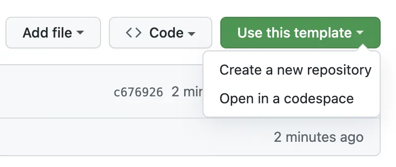
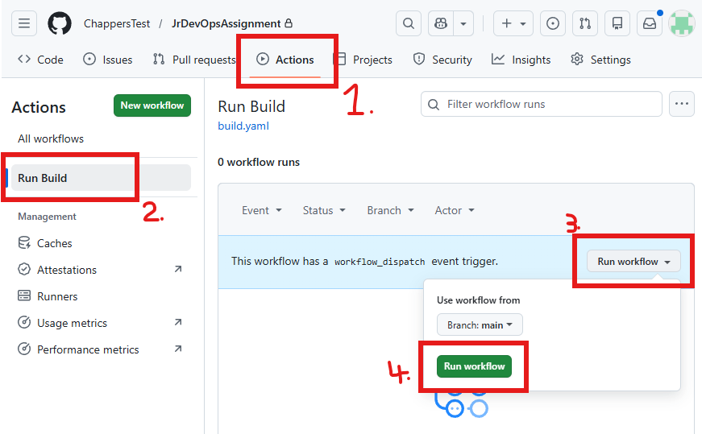
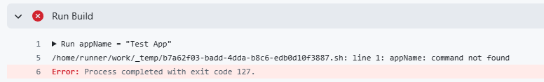

# Junior DevOps Engineer Technical Assignment

You have been tasked with maintaining and improving a CICD solution for building and deploying a project via [GitHub Actions](https://docs.github.com/en/actions).

An existing GitHub Action workflow file exists at `.github/workflows/build.yaml`. It first builds a simulated application, and then uploads it to a CDN.

There are two scripts in the `cli` directory that will simulate calls to external tools. These scripts *cannot* be modified, but must be worked with and used to make the pipeline function. Working with and around these immutable scripts is intentionally designed to allow you to demonstrate your ability and teach you to think creatively.

Solving issues in existing pipelines, extending their functionality, and troubleshooting problems arising from using software in the real world that may not be well-documented or has unexpected quirks, is common in DevOps.

> **🤖 AI Disclosure:**
>   This assignment is designed to test your ability to solve problems, be creative, and think computationally. Use of AI to assist you in the completion of this assignment is acceptable, however you must clearly label its use and delineate between human and AI-generated content in your submission. 
> 
> You will be expected to present and clearly articulate information about your assignment yourself without the use of AI in your technical interview. 
> 
> <u>Use of AI to answer questions during the interview process is prohibited.</u>

## Assignment

The build pipeline at `.github/workflows/build.yaml` is currently failing and needs modification to first work as intended.

Following the fixing of the pipeline, you receive a number of feature requests to extend its functionality.

Below are series of tasks that will walk you through making a copy of this repo, fixing the existing pipeline, and finally adding features at the request of hypothetical client and QA engineers.

At each stage of the assignment, all previous features must still work. To be considered successful, the pipeline ***must***:
- Successfully run the build script to create the application
- Successfully upload ***all*** build artefacts that result from the build process

Please keep notes of the issues you found along the way and what you fix.

This is an open-book assignment and you are welcome to use any resources or mateirals you deem necessary to complete it.

> **⚠️ Warning:**
>  The build and upload scripts that the action makes calls to in the `cli` directory are designed to simulate external 3rd party processes and ***should not be modified***.
>  <u>Your submission should not include any changes to these two files.</u>

## Submission
Your submission should be link to a Git repository that contains, at minimum;
- The `.github/workflows/build.yaml` file with correct directory structure
- The `cli` directory and *unmodified* `build.sh` and `upload.sh` scripts within it from this repo
- Any other supporting files you choose to create, including any notes
- The GitHub Action and any other resultant pipelines should be fully functional and runnable

Please email your submission as a link to the resulting Git repository (please ensure its [visibility](https://docs.github.com/en/repositories/managing-your-repositorys-settings-and-features/managing-repository-settings/setting-repository-visibility#changing-a-repositorys-visibility) is set to Public) to [will.chapman@prismsvr.com](will.chapman@prismsvr.com)

For any clarifications please email [will.chapman@prismsvr.com](will.chapman@prismsvr.com)

> **❗Forking this repository is strongly discouraged to ensure the privacy of each applicant's submissions.**

# Tasks
Click each of these tasks to expand them.

***If you need to a supply a credential of any sort as part of this assignment to fix any issues in the pipeline or add features, then any dummy value may be used and will be considered valid.***

Task #1

Begin by setting up a new repository under your GitHub account for this asignment. Its visibility should be set to Public.

Recommended: Use this repository [as a template](https://docs.github.com/en/repositories/creating-and-managing-repositories/creating-a-repository-from-a-template#creating-a-repository-from-a-template) to create a new repository.
1. Click **"Use this template"**
2. Click **"Create a new repository"**
3. Set up the repository as you normally would.

You can also create a new repository from scratch and copy this repository's structure into your new assignment repository.

> **❗Forking this repository is strongly discouraged to ensure the privacy of each applicant's submissions.**

 

Task #2

You should now have a complete repository that you can work on. Begin by running the build pipeline for the first time to test it.

1. Click the **"Actions"** tab
2. Click the **"Run Build"** workflow
3. Click the **"Run workflow"** dropdown
4. Click the **"Run workflow"** button to run the pipeline

 

Task #3

After testing the pipeline above in Task 2 you should have identified that it fails to run with the below error.

Your task is to fix this error, as well as any further errors and bugs you discover, so that the pipeline successfully runs. To be considered successful, the pipeline ***must***:
- Successfully run the build script to create the application
- Successfully upload ***all*** build artefacts that result from the build process

You will encounter several different issues whilst fixing this pipeline. If at any stage you need to provide credentials then any dummy value can be used.

Please remember to keep notes about the problems you encountered and how you fixed them.

 

Task #4

You should be now have a functioning pipeline that builds and uploads all resultant artefacts successfully.

You receive a feature request from the engineering team to be able to add a custom name to the built application. To the best of your ability, include this feature in the pipeline.

Remember that to meet the criteria of success, all artefacts must upload successfully.

 

Task #5

The engineering team is very happy with this feature, and want you to add a feature that includes versioning the application. They also don't want to upload every single build to the CDN; they only want to upload it when they push to a production branch.

When asked how they would like the application to be versioned and how to determine if the build should be deployed, the VR team replies that they are leaving it to you to implement the features the way you best see fit.

 

Task #6

The engineering team is concerned with reports about slow performance on some devices. What can you do within the scope of this assignment to provide them with the information and tools required to profile their builds? Implement this.

 

Task #7

Leadership has decided to release the application on iPhones to capitalise on that marketshare. Add the ability to perform multi platform builds for iOS and Android. 

 

Task #8

Open Ended:
Improve the build pipeline as you see fit to make it as extensible and scalable as you can.

Consider what options a client or QA engineer would want available to them when building and how they would want to use the build pipeline.

Consider what CICD best practices you might be able to implement in your remaining time.

Feel free to create new scripts and workflows, and modify the repository as you see fit. The only things you can't change are that you must use the unmodified `build.sh` and `upload.sh` in the `cli` directory.

